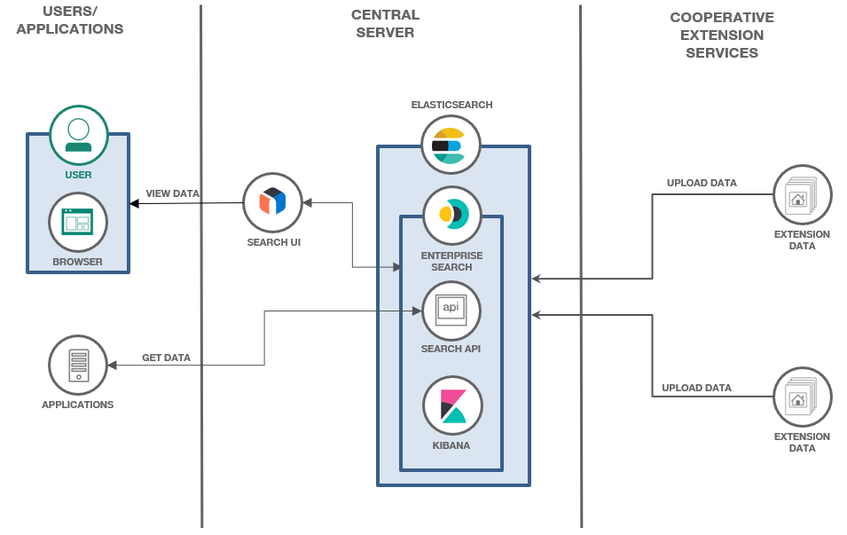

# AgRec (Prototype)

AgRec is an open source Agriculture Recommendations provided by the [Cooperative Extension Services](https://www.gardeningknowhow.com/garden-how-to/info/what-is-extension-service.htm) to help the local and global farmers, gardeners, basically anyone who is interested in these recommendations for their day-to-day usage.

[Call for Code](https://callforcode.org/), [Clemson Cooperative Extension](https://www.clemson.edu/extension/) and [AgStack](https://agstack.org/) under the [Linux Foundation](https://www.linuxfoundation.org/) have come together to create AgRec initiative.

> AgRec is still in the prototype stage and has been working towards an MVP.

## AgRec Solution Design

We are leveraging the Elasticsearch, Enterprise Search and Kibana to upload, store and retrive the recommendations data. Also we are utilizing the Search UI to view the recommendation data from the browser.

  

The Cooperative Extension Service will upload their agriculture recommendation data to Elasticsearch's Enterprise App Search engine through Kibana or directly from the Enterprise Search Dashboard.

The Users will be able to view the recommendation data from the Search UI in the browser. And can access the recommendation data with the Enterprise App Search endpoint.

## Getting Started

Currently we are providing access to the AgRec data with:

1. [AgRec Search UI](https://agrec-search-ui.agextension-514bd37ab295f8aeaf548c9dacf39708-0000.us-south.containers.appdomain.cloud/)
2. [AgRec API](https://developer.ibm.com/apis/catalog/callforcode--agricultural-recommendations-agrec)

> Since the project is still work in progress, we are working towards a structured process for Cooperative Extension Services to upload their data into Elasticsearch's Enterprise App Search engine. Currently we are working with [Clemson Cooperative Extension's](https://www.clemson.edu/extension/) sample datasets.

## License

Copyright 2021-2022 AgRec

This project is licensed under [Apache 2 License](LICENSE) and [CDLA 2 License](CDLA-Permissive-2.0.pdf).
